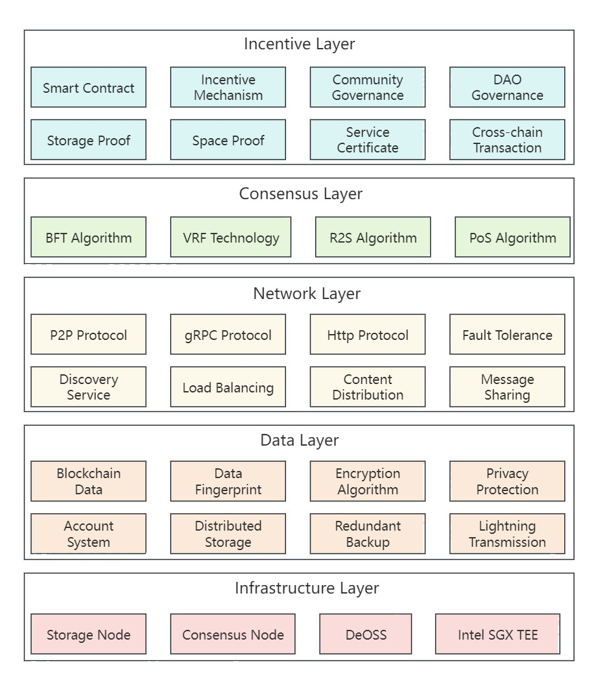

The blockchain layer is further divided into five layers:

**Infrastructure layer** - consists of hardware equipment, including servers, network hardware, and storage hardware for the CESS blockchain.

**Data layer** - supports scalable data storage and provide a series of data processing and data security guarantee mechanisms such as redundant backup, privacy protection, integrity verification.

**Network layer** - responsible for node connection and data transfer, providing load balancing and P2P network protocols and algorithms.

**Consensus layer** - provides consensus mechanisms on transactions.

**Incentive layer** - achieve fair income distribution through smart contracts and other incentive schemes.

# Infrastructure Layer

CESS invites three types of resources to join the network: DeOSS gateway, storage node, and consensus node. The DeOSS gateway is responsible for proxy upload, download, encryption, and preprocessing of user data, and supports the construction of a distributed content distribution network to provide users with simple, efficient, and fast data access services; Storage nodes accept consensus node scheduling to build a stable and reliable data persistence infrastructure for CESS. Consensus nodes focus on the scheduling of various resources and the consensus of storage network status, and verify the stored data and available capacity of the entire network through a trusted execution environment to ensure the stability of services and data security.

# Data Layer

The data layer maintains the metadata on the CESS blockchain and user data stored dispersedly in various storage nodes. Users can choose to encrypt and store the data to protect privacy. Any data stored in CESS needs to go through redundancy and sharding, and then be randomly distributed to various storage nodes to prevent data loss due to single point of failure issues. CESS will also conduct regular integrity checks on data through a multi-copy recoverable storage proof mechanism to ensure data security, integrity, and persistent storage.

# Network Layer

CESS has a distributed layered network architecture that distributes tasks and workloads through a decentralized blockchain network. Nodes within each layer are internally equivalent, serving as both requester and responder, providing resources and services to each other. CESS will also layer the network, establishing a blockchain consensus network, a data transmission network between storage nodes, and a data caching and sharing network between DeOSS. Each network will cooperate with each others to provide stable and efficient data transmission services for CESS.

# Consensus Layer

To ensure that the transactions and activities on the blockchain network reach a consensus quickly, CESS proposes a novel Random Rotational Selection(R²S) consensus mechanism based on Byzantine fault tolerance to improve the performance and scalability of the system.

The CESS network has two types of consensus nodes: **on-duty consensus nodes** and **candidate consensus nodes**. Theoretically, any node can become a consensus node via staking. There is no limitation to the number of candidate consensus nodes. CESS uses a credit rating method to verify the nodes and select qualified nodes as consensus candidate nodes. Within each time window, CESS randomly selects the subsequent **eleven consensus nodes** as new on-duty consensus nodes responsible for on-chain transaction validations, data packing, and data block generation. The CESS consensus mechanism aims to achieve network security, system transparency, randomness, and fairness to miners.

# Incentive Layer

CESS's primary system resources are storage and network resources. Miners can provide these two types of resources when joining the CESS network. The network will reward the miners with CESS tokens according to their contributions to the network.

# Distributed Nature of CESS

CESS tokens are distributed in the following ways:

**Storage**: Storage Miners with storage capacity join the network to earn tokens proportional to their bandwidth and storage capacity.

**Consensus** (a.k.a on-chain logics): Consensus Miners with qualified computational resources can stake CESS tokens to run candidate consensus nodes. If selected by CESS random consensus mechanism as one of the on-duty validators, these nodes will earn rewards.

**Community Governance**: Developers, community members, and partners can submit their funding proposals on-chain. These proposals will go through a voting process. When a quorum is established, corresponding proposals will be enacted, and rewards will be issued. Submissions are accepted based on the governance of a Decentralized Autonomous Organization (DAO). CESS community transparently operates the Community Development Fund (CDF) through the voting process.

**Token Distribution**: All incentive-related activities are implemented based on smart contracts, ensuring the fund's distribution fairness and transparency.
